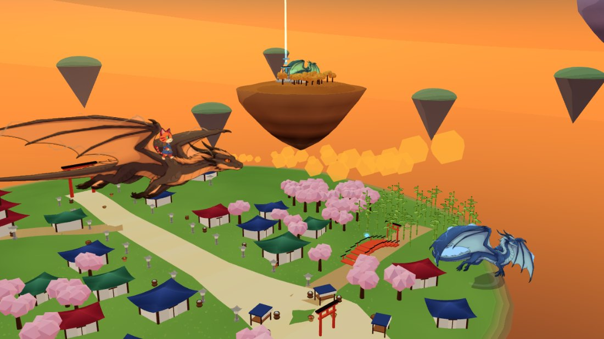
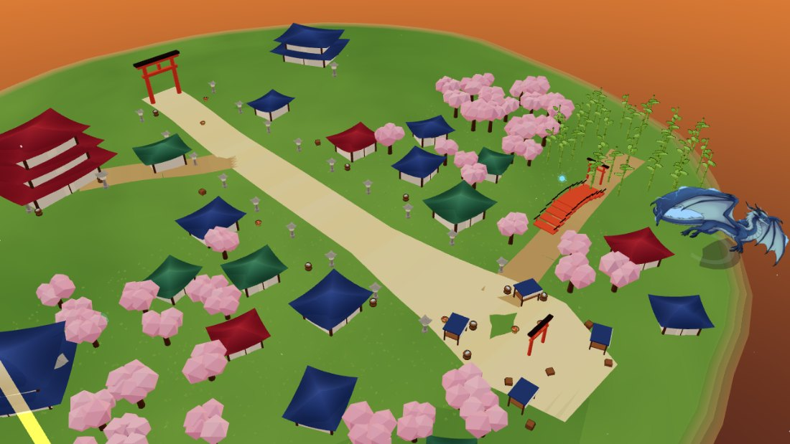
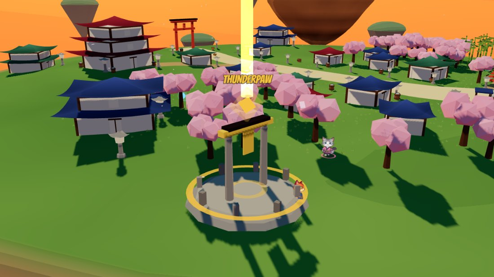
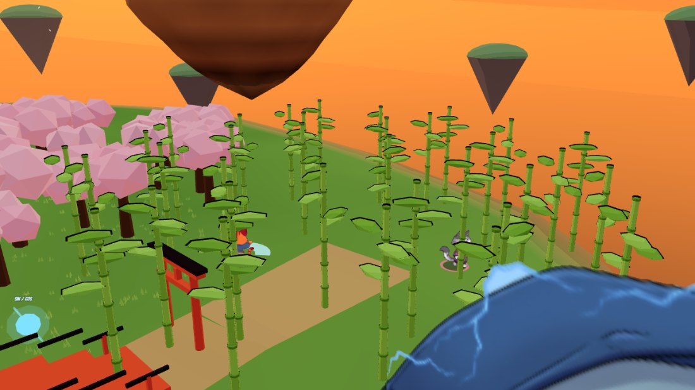
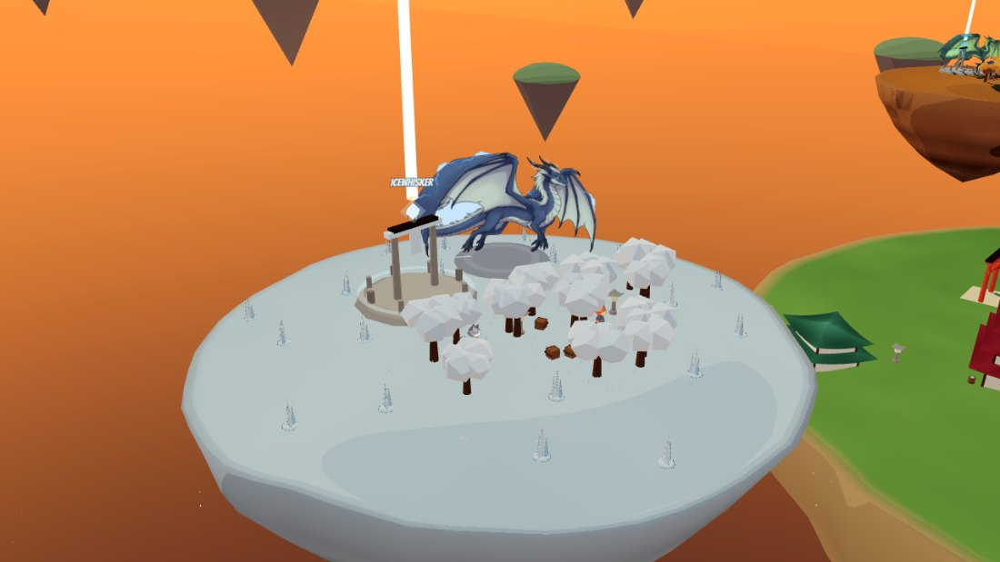
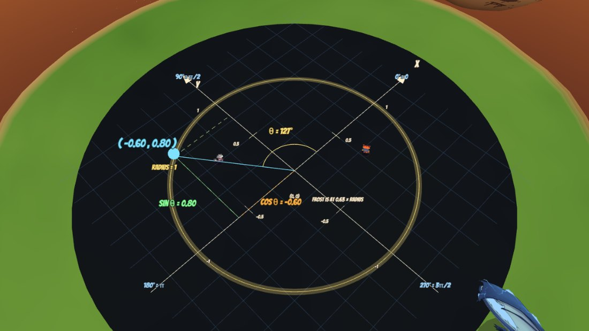

# Katana Kitties

**A split-screen co-op game about samurai kittens causing trouble across a
chain of floating Japanese islands — and riding storm dragons between them.**



**Up to four players**, on whatever you have: two on the keyboard, two on
Joy-Cons, a PS5 pad and an Xbox pad, or any mix of the lot. Run, double-jump,
draw a katana, knock over absolutely everything that isn't nailed down, then
whistle up a dragon and go and do it on the next island. When you've flattened
enough of the world, an eighth island appears in the sky with a tournament ring
on it and you fight each other in it. It runs in a browser tab.

**Pick up a controller and you're in.** Pads are dealt out in the order they
connect and always outrank the keyboard, so the moment a spare one is actually
used it takes a seat — and whoever's left plays on the keyboard, each with a
complete one-handed set of keys on her own side of it. A third and fourth player
can join mid-game without interrupting anybody.

It was made for — and partly *by* — my nieces. The cat-head menu on the title
screen is a faithful reproduction of a drawing one of them made, buttons and
all, and the name was hers too. **The six clan leaders came off a page of her
character designs** — eight cats, each labelled with its breed. The rest grew
out of the things they like: *Warriors*, *Storm Dragons*, Minecraft, Wobbly
Life and Untitled Goose Game.

There's a second reason it exists. I'd been teaching one of them sine, cosine
and the unit circle on graph paper, and this is that lesson made walkable —
see [Teaching the maths](#teaching-the-maths).

## A look around

| | |
|---|---|
|  **The town** — a road, a market, a red bridge and 40-odd knockable props |  **A clan shrine** — find the beam, stand in the ring, get a power |
|  **The bamboo grove** — the one thing no dragon can burn, and what a panda eats |  **The snow island** — icicles to smash and a frost dragon to ride |



*The Dojo of the Turning Circle: a whole island that is a walkable unit circle.
Stand on it and you become the point — the game reads your angle and draws sine,
cosine, the radius and your coordinates, live, from the same numbers that are
moving you.*

## Play it

**It's online: [katana-kitties.vercel.app](https://katana-kitties.vercel.app)** —
nothing to install, just open it. **Use Firefox if you're playing with
Joy-Cons**, same as locally; see
[Switch 2 controllers](#switch-2-controllers--use-firefox) for why.

The first load pulls about 35MB of sprite sheets and voice lines and then sits
in the browser cache, so it's slow once and instant afterwards.

To run it locally instead:

```bash
npm install
npm run dev
```

Then open the address it prints.

---

## Controls

|                  | Keyboard 1 | Keyboard 2 | Gamepad      |
| ---------------- | ---------------- | ---------------- | ------------ |
| Move             | `W A S D`        | `O K L ;` or the arrow keys | Left stick   |
| Jump / fly up    | `Space`          | `'` or `Right Ctrl`, `Numpad 0` | `A`          |
| Slash            | `F`              | `J`, `Numpad 1` or `/`    | `X`          |
| Interact / dive  | `E`              | `I`, `Numpad 2` or `,`    | `B`          |
| Mount / dismount / ward | `Q`       | `P`, `Numpad 3` or `.`    | `Y`          |
| Sprint / boost   | `Left Shift`     | `Right Alt` or `Right Shift` | `ZL` / `ZR` |
| Zoom the map     | `Z`              | `X`                  | `R` / View   |
| Maths overlay    | `M`              | `M`                  | `L` / Home   |
| Pause            | `Esc`            | `Esc`                | `+` / Start  |
| **Join the game** | `Enter`         | `Enter`              | just pick it up |

**`Enter` always means join, and `Esc` always means menu.** Press `Enter` and the
next keyboard player is in; press it again and the one after that joins too —
first on WASD, then on the arrows. It used to be each set's *own* key, so which
key let you in moved about depending on how many controllers were plugged in,
and with one controller `Enter` was player 2's pause key and opened the menu
instead. Nothing on the keyboard opens the menu now except `Esc`.

**The two keyboard sets are a queue, not two particular players.** Controllers
fill up from player 1 down, and whoever's left goes on the keyboard: WASD first,
then the arrow keys. With nothing plugged in that's the game you know — P1 on
WASD, P2 on the arrows. With one controller, P1 has it and **P2 gets WASD**;
with two, the keyboard players are P3 and P4. The same keys always do the same
jobs, for whoever's holding them. See
[Up to four players](#up-to-four-players) for the full table.

**Player 2 plays with one hand too, on `O K L ;`.** Player 1 has always had
everything under her left hand — move on `WASD`, with `Q` `E` `F` sitting round
it. Player 2 had the arrow keys and buttons a whole hand's width away on the
numpad, so she needed two hands and a full-size keyboard for a game her sister
plays with four fingers.

Now she has the same shape on her own side of the board:

```
        O                        W                 · O K L ;   walk
      K L ;    mirrors         A S D               · P I J     ride, clan, slash
    P I J                      Q E F               · '  or Right Ctrl   jump
                                                   · Right Alt          sprint
```

**`P` `I` `J` are to `O K L ;` what `Q` `E` `F` are to `WASD`** — same three
jobs, same positions, other hand. Sit side by side and neither of you has to
reach across.

**Everything she already knew still works.** The arrow keys still walk her, the
numpad still does all four buttons, and the keys beside the arrows still work on
a laptop with no numpad — they read `,` `.` `/` `'` for clan, ride, slash, jump.
Three of them moved, each because the new cluster took its key: `;` is "walk
right" now so ride went to `.`, jump moved to `'` so slash took `/`, and
`Right Ctrl` became a second jump key so sprint is `Right Alt` / `Right Shift`.

**And the browser no longer steals her keys.** In Firefox `/` and `'` open Quick
Find and a tap of `Alt` jumps to the menu bar — so player 2 mashing jump used to
pop up a search box that ate the keyboard. The game now blocks the browser's own
shortcut on any key it has bound, so nothing needs turning off in Firefox's
settings first. `Ctrl`-anything is deliberately left alone, so `Ctrl+L`, reload
and the dev tools all still work.

Mount climbs onto whichever dragon is in reach, or onto your own panda if
there isn't one. **`Esc`**, or **`+`/Start on a controller**, opens the pause
menu — resume, settings, how-to-play, restart, or back to the title screen.

**You can play the whole game without touching the mouse.** The title screen,
the pause menu, settings and the help page all take a controller: the stick or
d-pad moves the highlight, `A` picks, `B` goes back, and left/right change a
setting in place without opening a dropdown you couldn't get out of. The
highlight starts on the button you probably wanted, so on the title screen
pressing anything still just starts the game.

**Cutscenes only skip on Start** (or `Space` / `Enter` on a keyboard). Any
button used to do it, which meant a thumb resting on jump threw away a
79-second story with seven recorded voices in it.

Jump twice for a double jump. Sprint and slash to send market stalls flying.
Fly low and fast on a dragon to scatter a whole street at once.

## The story

Press PLAY and an old calico called **Patchfur** tells you where you live, then
flies you past every clan in the sky. It runs about 70 seconds, **Start (or
`Space`/`Enter`) skips it**, and **WATCH THE STORY AGAIN** in the pause menu
plays it back.

There's no video file and no second canvas: the cutscene drives its own camera
through the *same 3D world you're about to play in*, and the leaders it flies
to are the same characters standing at those shrines when you walk up to them
afterwards. Islands slide past each other, and the beam of a shrine you haven't
reached yet stands up over the horizon behind whoever is talking.

| clan | leader | breed |
| --- | --- | --- |
| Thunderpaw | Sunstreak | Siamese |
| Riverclaw | Rippleclaw | Turkish Van |
| Shadowtail | Duskcoat | Tuxedo |
| Windwhisker | Galemane | Maine Coon |
| Icewhisker | Snowmantle | Himalayan |
| Pandapaw | Bambooheart | Ragdoll |

Every one of them is standing at her own shrine for the rest of the game. Walk
up and she'll tell you what her clan gives you before you commit to it.

## Meet the clan leaders

Walk up to a shrine and **stand there**. After a couple of seconds the leader
stops you, fills the screen and tells you who she is — out loud, in her own
voice. It happens once per leader, Start skips it, and **you can't swear
to a clan you haven't met**, so the introduction is the way in rather than
something in the way.

## Collect the seven dragon balls

**There is one star on every island — seven islands, seven stars.** The count is
shared between the two of you: you're hunting together.

**Only the first one is just lying there.** The other six are locked, and each
lock wants something different — so finishing the hunt means using nearly
everything the game has taught you, not just flying over seven islands and
looking down:

| star | where | how you get it |
| --- | --- | --- |
| 1★ | home | lying in the open, by the town |
| 2★ | autumn | in a **grotto** — land, find the glowing doorway, walk the maze |
| 3★ | frost | **sealed in ice**. Fly a dragon at it and breathe |
| 4★ | bamboo | **under a boulder**. Only a panda's claw will crack it |
| 5★ | ash | on top of a **stone spire** far too tall to jump. Fly up |
| 6★ | dusk | another **grotto** |
| 7★ | dojo | up three **floating shards**. You need Shadowtail's triple jump |

Each locked star tells you what it wants when you get close, and the colour of
its light says which kind it is from the air.

**The grottos are little mazes.** Two rings of rock inside the doorway, each
with its gap somewhere else, and a spur in each corridor that turns one way
round into a dead end — so you have to walk it rather than see the star from
the entrance. Glowing crystals light the way, the star shows as a soft column
through the walls so you know roughly where you're heading, and **the roof
lifts off as you step inside**. Any wall that would hide your kitten — inside
or out, including the dome when you're only walking past — opens a soft hole
around her instead of the whole building disappearing. **Look for the lit
doorway**: it juts out from the dome with a lantern either side, so you can
pick it out from the air. You can't jump the walls, cut them, or burn them —
the mouth is the only way in.

**The 7★ really does need three jumps.** You have to be standing on the top
shard to take it, and you have to have climbed there yourself: flying up and
hopping off onto it doesn't count, and neither does grabbing it at the top of
a double jump on the way past.

**Knock over absolutely everything** — all of it, on every island — and
Patchfur has something to say about what you've done, in her own voice, over a
shot that pulls back until all seven islands are on screen at once. Nothing
stops when she's finished; that's rather the point of what she says. Then she
points you at [the arena](#the-world-martial-arts-tournament) — which by then
has been open for a while, since Mr. Satan unlocks it at 80%.

Find one and your kitten stops and **holds it over her head** while the camera
swings in. It only happens on her screen: if your sister is off cutting bamboo,
her half of the split carries on as normal.

Find all seven and Patchfur tells you where to take them. Then **the sky goes
dark**, and a very long green dragon called **Ryuuseki** is waiting over the
great torii.

He seats **both of you, and you do different jobs**:

| | |
|---|---|
| **First one on** | flies him — same controls as a storm dragon, and fires **one** beam |
| **Second one on** | works the beams — your stick aims, ATTACK fires **all seven** |

The fan belongs to the **second seat**. Whoever is flying gets one beam whether
she's alone up there or not; the seven — wide enough to flatten a whole market
street in one press — only ever come from the kitten in the gunner's seat. So
climbing on second isn't tagging along, it's the job.

Wherever she points, the beams leave **his mouth** and go where his head is
pointing: she can swing the fan a good way either side, but never back down his
own body.

He outreaches and outhits every storm dragon in the game, he has his own music,
and **once you're both aboard the screen joins into one shared view** — one
dragon on two half-screens is the worst way to look at him. With only one of
you on him the screen splits as usual, so whoever is still on the ground keeps
her own half.

## Up to four players

**Two kittens by default, exactly as before — press PLAY and you're Ember and
Frost.** Nothing about the two-player game has changed.

**A third and fourth can join at any time, mid-game, without interrupting
anybody.** A little card appears in the corner: push the stick left and right to
pick your kitten, press **JUMP** to start playing. The others carry on the whole
time.

**Just pick up a spare controller.** If it's plugged in and nobody's playing on
it, the moment you actually use it — press something, move the stick — you're in.
A pad sitting on the sofa or charging on the side doesn't seat anybody, so
nothing happens by accident. Pressing **START** on it still works too.

**On the keyboard, press `Enter`.** Once for the next player, again for the one
after — WASD first, then the arrows.

The bottom of the screen tells you either way: *"P1: gamepad · P2: WASD · press
ENTER to join as P3"*. It's in the pause menu too, and it goes quiet when the
party's full.

| | | |
| --- | --- | --- |
| **Ember** | orange | the one from the drawing |
| **Frost** | grey | |
| **Storm** | teal | *new — she needs a proper name* |
| **Blossom** | violet | *new — she needs a proper name* |

**There are four dragons on the home island**, one each, standing either side of
the road at both ends of the town — so a kitten who joins fourth still has
something to climb onto and nobody is left on the ground watching.

**Storm and Blossom are placeholders.** They're the same two cats in different
colours, and the girls should name them and pick the colours — it's one small
table in the code (`src/core/palette.js`).

**Controllers fill up from player 1, then the keyboard takes what's left.** Every
controller is just a controller — Joy-Con, PS5, Xbox, whatever — and the one that
connected first is player 1:

| controllers | P1 | P2 | P3 | P4 |
| --- | --- | --- | --- | --- |
| none | WASD | arrows | | |
| one | controller | WASD | arrows | |
| two | controller | controller | WASD | arrows |
| three | controller | controller | controller | WASD |
| four | controller | controller | controller | controller |

**Whoever's first off the controllers gets WASD**, not the arrow keys — WASD has
the space bar, the arrows have the numpad, and nobody should be handed the worse
half because of her slot number.

**Mix whatever you like.** Two Joy-Cons, a PS5 pad and the keyboard is four
players on four different things.

**The screen gives a pane to each GROUP of you, not to each of you.** Stand
together and you share one view; walk away and you get your own. So three
kittens in the market and one off on the bamboo island is **two** half-screens,
not four — the three who are together get a big shared shot of the town, and the
one who wandered off gets the other half to herself. All four together is still
one full screen, and all four apart is still quadrants. It re-groups as you
move, and nothing jumps when it does.

**Standing together never costs you screen.** Two of you sharing a view get a
full-width strip across the top — *half* the screen, not a quarter — and the two
playing on their own take a quarter each below. It works out at the same amount
of screen per kitten however you're grouped, so teaming up is never the worse
deal. The wide shape is deliberate: the camera looks down at three-quarters, so
a short wide pane shows the ground either side of you where a tall narrow one
would show sky and floor.

**There are two minimaps at most**, one for each of the first two panes, rather
than one per kitten — four maps on four quadrants covers up four corners of the
game at the moment there's most to look at. Everybody is drawn on both of them.
Everyone does get her own score badge along the top.

**Anybody can drop out** from the pause menu, and the game carries on for
everyone else. Whatever Kotodama she was wearing drop back into the world so
nothing is lost.

## The World Martial Arts Tournament

**When you've done everything else, there's a ring.**

Find all seven dragon balls, ride Ryuuseki, and half a minute later a very
loud cat in a championship belt interrupts your afternoon. **Mr. Satan** —
strongest cat in the world, and he'd like you to know it — is building an
arena, and he'll open it once you've knocked over **80% of everything**. He
calls out your progress as you go.

At 80% an eighth island appears in the sky, far to the north. **You can't fly
there** — it isn't there until he opens it. Go and find him in the town,
**both of you together**, say yes, and his griffin carries you north while you
watch. (It takes eight seconds and Start skips it.)

Then you fight each other.

### Leagues

**With two of you it's a duel, exactly as it always was.** With three or four,
you pick a league when you get there — anyone can choose, and **each league keeps
its own record board**, so a tag-team win and a duel win are separate
achievements.

| league | players | |
| --- | --- | --- |
| **Duel** | 2 | one against one |
| **Free for all** | 3–4 | everyone for herself, last one standing takes the round |
| **Tag team 2v2** | 4 | two a side — **your partner can't hurt you** |
| **Handicap 2v1** | 3 | two against one |
| **Handicap 3v1** | 4 | three against one |
| **Free teams 2v1v1** | 4 | a pair against two loners — everybody else is a target |

**The outnumbered fighter gets a slightly bigger bar** — a fifth more health,
whether she's against two or against three. It's a head start, not a
compensation: she used to get a *whole extra bar per opponent*, which meant a
3v1 champion on 300 health nobody could shift, and a round that only ended when
she got bored. What actually keeps a handicap match alive is the feast, the
snacks and the fact that you fly further the more hurt you are.

**Then you pick your sides.** Any league where somebody has a partner shows a
PICK YOUR SIDE screen. **Everybody starts on NO TEAM** and has to walk herself
out of it: push **your own stick** left and right to move between NO TEAM, RED,
BLUE and GOLD, and press **JUMP** once everyone has picked and the teams are
legal — a 2v2 needs two and two. It tells you what's still wrong until they are.

It used to skip itself. The screen opened with everybody already on a side and
the button you'd just pressed to choose the league counted as the button that
confirmed it, so a 2v2 jumped straight into the match with whoever picked up a
controller first as the pair.

**Everyone gets a health bar**, grouped by team along the top, each in her own
kitten's colour. **And everybody wears her team's colour as a pennant over her
head**, so you can tell across a busy ring who you're supposed to be helping.

**Hit your own partner and you daze her.** No damage — but she loses a second
and a half of control and gets a ring of stars over her head, so mashing the
attack button in a team match costs your own side. Look before you swing.

**In a team match the round isn't over until a whole side is down.** Your partner
going down leaves you fighting alone, which is rather the point of having one.

**Winning pays.** Everyone on the winning side earns points — about what one
Kotodama costs — and you can go straight back and do it again. It's the only way
to earn points once you've knocked over everything in the world.

| | |
|---|---|
| **Health** | 100 each, shown over your head and along the top of the screen |
| **Rounds** | best of three — two wins takes it |
| **The clock** | two minutes a round, counting down over the round number. If it runs out, whoever's dealt the most damage takes the round |
| **Standing slash** | quick and safe |
| **Sprint + slash** | the big one — this is how you throw your sister across the ring |
| **Jump + slash** | hurts most, hardest to land |

**No new buttons.** It's the same attack button you've been knocking over
barrels with all afternoon; what changes it is whether you're running or in
the air when you press it.

### Something runs past you. Eat it.

**There are up to six animals loose on the deck** — rats, rabbits and birds, a
different mix every time, and a new one wanders in every minute or so. Catch
one and you get health back, which is the only way there is to get any.

**Hit it with your katana and it stops dead**, sitting there with stars round
its head. Then walk up and **hold ATTACK for two seconds** and it's gone. That's
it — same swing you use on barrels, same button for the meal.

| | | worth |
| --- | --- | --- |
| **Rat** | slowest thing out there. The easy one — you can catch it at a walk | +12 |
| **Rabbit** | **faster than you can run.** You have to sprint at it — and when it spots you it starts leaping clean over your head, and you can't grab one in mid-air, so you have to time the swing too | +15 |
| **Bird** | cruises **well above your swing**, so you have to jump to reach it. Hit it and it lands **in your mouth**. Five seconds to swallow it | +20 |

You can skip the swing entirely if you can just walk into one — press attack
right next to a rat and you've got it.

**Your kitten sits down and eats it with both paws**, hunched over, eyes shut,
with the poor thing held up at her mouth looking extremely surprised. A rabbit
is too big to lift, so it stays on the floor and shrinks up toward her instead.
It takes two seconds and **you can't move for any of them** — your sister can
see exactly what you're up to, so doing it in the middle of a round is a
gamble. Let go, or get hit, and it wriggles off and you get nothing.

**Don't fall off.** The painted red border is your warning — your foot ring
flashes red as you reach it — and the **edge of the stone is the rule**. Come
down on the ground below the ring and you lose a third of your health and get
thrown straight back into the middle, the moment you land.

Two things that don't count: standing on the last stride of stone outside the
paint (you're still on the stage), and sailing over the line in the air after a
big hit — you've got every frame of the arc and all your jumps to get back. And
the more health you've lost, the further you fly when you're hit, so rounds get
wilder as they go on.

**You can only fight in the ring, during a round.** Nothing you do to each
other anywhere else in the world does anything at all — not in the town, not
during the countdown, not between rounds.

### Between rounds: one of you eats, the other one gets wings

**Winning a round doesn't heal you.** You keep the health you finished it with
and go into the next round on it — so between every round there's a **fifteen
second FEAST**. You get a tenth of your bar back for free, the deck is restocked
to six animals, and the rest is up to you.

**And whoever got knocked down turns into an angel cat.** You go pale and
see-through, big white wings open behind you, a gold halo pops up over your head
— and you get fifteen seconds of flying anywhere you like over the arena. You
can't fight, you can't eat, and you can't get in your sister's way, which is
rather the point of it. When the gong goes you come back **with a full bar.**

So losing a round costs you nothing and winning one costs you whatever it took.
That's deliberate: it means a match is never over after two minutes, and it
means the fifteen seconds where nobody can hurt anybody is the busiest part of
the whole tournament.

**The winner signs the board — and only the winner.** Three to five letters,
picked with the stick: up and down change the letter, left and right move along.
Everybody else's stick is ignored for the whole thing, so nobody can spell your
name for you or press JUMP on a name you haven't finished. In a team match
either of the two who won can type it. Your score comes from
how many rounds you won, how much damage you dealt, how fast you did it and how
little you took. **The board is saved** — it's the only thing in the game that
survives closing the tab, so a win last Saturday is still there today. Top ten,
and you can look at it any time from the pause menu (**RECORD BOARD**) or by
walking up to the big board beside the ring.

When it's over the griffin takes you home, and you can go straight back and do
it again.

**Had enough?** **QUIT THE MATCH** appears in the pause menu while you're at the
arena — it calls the whole thing off and the griffin flies you back to town, with
everything you've collected untouched. It's there from the moment you land,
including on the league and team screens, so a match nobody meant to start costs
nothing.

## The Powerup Kotodama

**Knock over every last thing in the world and the Kotodama wake up.** Whoever
collected more of the little sin/cos orbs is handed a **Powerup Kotodama** —
and if you both collected the same number, you *both* get one, including if
that number is zero. It's random: you get a thing you *have*, not a thing you
picked, which is what makes trading worth doing.

The old orbs dissolve. From then on there are **eight kinds** hidden around the
islands, and you can wear up to **eight at once** — they stack, so two Gale
orbs make you twice as much faster, and a kitten in a full set is visibly
wrapped in them.

| | orb | what it does |
| --- | --- | --- |
| 疾 | **Hayate** — Gale | run faster |
| 斬 | **Nagagiri** — Long Cut | longer katana |
| 剛 | **Kongo** — Adamant | more health in the ring |
| 跳 | **Tobi** — Leap | an extra jump |
| 壁 | **Kabe** — Ward | **hold** the mount button with nothing to climb on: a shield nothing gets through, up to 2 seconds, and you float while it's up |
| 落 | **Otoshi** — Power Dive | interact in the air — drop like a hammer |
| 三 | **Sanzan** — Triple Slash | *hold* slash for three cuts. You can't move through them |
| 突 | **Totsugeki** — Charge | slash while sprinting — straight through everything, gravity off |

The three attacks are new moves, not new buttons: they are the buttons you
already use, in a situation you already understand.

**Four per player are hidden out in the world** — eight with two of you, sixteen
with four — showing on the map in their own colours, so the answer to "where's
the Ward" is never "fly over everything again". With two players that's one of
each and no spares at all: if you want *two* of something you have to buy it or
get it off your sister. With four there are duplicates, because one Ward between
four kittens means three of you could never find one.

**A dealer opens a stall in the market.** He buys and sells for the points you
earned knocking things over — but he is expensive on purpose: every point in
the world is 4550, so a fair split buys you *three* orbs. He keeps **four each
of Gale, Long Cut, Adamant and Leap** — the four worth stacking — and **one
each of the four moves**. Four of anything costs 2600, which is more than you
will ever have. Selling gives you 75% back, and it is the only way to get back
under eight slots.

**So you trade.** Open **CHARACTER PROFILE** from the pause menu and you each
get your own cursor, in your own colour: pick the orb you're offering, and you
*both* have to confirm before anything moves. Nobody can take one off you, and
either of you can just give one away.

**You can put points on the table too.** There's a POINTS row under your orbs —
push the stick left and right to change how many you're offering. So you can buy
an orb off your sister, or just hand her the points to go and buy her own.

**With more than two of you, the two who trade are the two who confirm.** Everyone
has her own cursor and her own offer; when exactly two of you have pressed
confirm, that's the trade. A third confirm is refused rather than guessed at —
nobody ends up giving an orb to somebody she didn't agree to give it to.

## Raise a panda

Five of the six clans hand you a power the moment you stand in their ring.
**Pandapaw** hands you a job instead.

Its shrine is on the bamboo island. Swear the oath, then go and cut bamboo —
**20 canes** and a panda cub trots out and follows you everywhere. **20 more**
and it grows big enough to climb on. A grown panda runs twice as fast as you
do, jumps higher, and has a **claw swipe** on the attack button that hits far
wider and harder than the katana. Your clan badge counts the canes down for you.

The claw is also the only thing besides a katana that cuts bamboo, and it cuts
about four canes to the katana's one — so once you've raised a panda, clearing
a whole grove on its back is much faster than doing it on foot. A dragon still
can't touch bamboo from the air.

You each raise your own — Ember's is **Bao**, Frost's is **Mochi**. Bamboo you
cut before you ever found the shrine still counts toward **the cub**, so an
afternoon in the grove is never wasted — but the **20 that grow it up start
from the day the cub arrives.** You have to actually raise the animal; you
can't turn up with a full sack and skip straight to riding one. A cub can't be
lost: it follows you on foot, waits where it is while you're off on a dragon,
and meets you wherever you land.

Nothing you knock over comes back. Cut a cane and it's cut — if it topples off
the edge of the island it stays gone, so what's still standing in the grove is
exactly what's still left to score.

**Join a different clan and your grown panda stops following you.** It's still
yours and you can still ride it, but it waits where you left it — so it turns
up on the map, like a dragon on its perch. Swear to Pandapaw again and it comes
back to heel.

### Switch 2 controllers

**Pair each Joy-Con to the computer on its own and it's just a controller** —
one Joy-Con, one player, dealt in the order they connect, exactly like a PS5 or
Xbox pad. Nothing to configure. Hold the little **sync** button until the lights
run and add it from your Bluetooth menu.

**Press a button on it afterwards** — browsers hide a gamepad until it sends
input.

#### The Joy2Win + vJoy route

> **If you're going through Joy2Win, play in Firefox.** **Chrome cannot read the
> vJoy analog sticks.** Buttons work, the sticks report `0.00000` forever.
> Firefox reads the same controller on the same machine correctly. This is a
> Chrome bug in how it parses the device, not something the game can work
> around — if the sticks are dead, the title screen says so and tells you to
> switch. **This doesn't apply to Joy-Cons paired directly**, or to any other
> pad; it's a vJoy problem.

Joy2Win presents both Joy-Cons as a **single** vJoy device, and the game splits
it down the middle automatically: P1 drives the left Joy-Con, P2 the right.
Nothing to set.

**And everything else you plug in still works alongside it.** Two Joy-Cons
through Joy2Win **plus a PS4 or PS5 pad is three players** — the pad is simply
the third controller. Splitting is decided **per device**, not as a mode for the
whole machine, which is what used to make this impossible: the setting asked "do
we split?" about the computer when it's really a question about one device, so
splitting the Joy-Cons switched the other pad off and leaving it alone gave both
Joy-Cons to the same kitten.

**Settings → Controllers** now asks the only question left: whether the pair is
*one each* (the default) or *both held by one player*. It touches nothing but
the Joy-Cons.

**A vJoy device shows up whether or not anything is feeding it.** vJoy is a
driver: once it's installed, Windows reports it forever, with no Joy-Cons paired
and Joy2Win not running. The game used to hand that phantom player 1 and leave
you on the keyboard wondering why nothing moved. Now it takes no seat until it
actually sends something — Settings → Controllers lists it as **asleep** and
tells you so.

**On the hosted version the controllers work exactly the same.** Joy2Win and
vJoy run on your machine and the browser reads the pad whatever page is open,
so hosting changes nothing about the input path — including the Chrome bug, so
it's still Firefox. One thing does change: **your saved calibration doesn't
come with you.** The button and stick map lives in `localStorage`, which
browsers key by site, so `katana-kitties.vercel.app` starts from the built-in
defaults no matter how carefully you tuned it on `localhost`. Wiggle both
sticks and press **DETECT STICKS** once on the new address and it's saved there
from then on.

In Joy2Win's `config.ini`, for two Joy-Cons: `controller = 0`, `orientation = 0`,
and **`mouse_mode = 0`** — with mouse mode on, a Joy-Con resting on a desk
switches to mouse control and stops sending its stick entirely.

**Settings → Controllers** is the calibration screen. It shows a live readout
per pad — which profile matched, which player reads which half, every axis with
the range it has travelled, the raw index of whatever you press, and which
action it lit. Nothing needs a code edit:

- **A button does the wrong thing** — click that action in the remap grid and
  press the button you want. Saved per browser.
- **A stick does nothing, or is rotated** — wiggle both sticks, then press
  **DETECT STICKS**. Or bind them by hand: *push RIGHT*, *push UP*.
- **Started fresh?** **RESET TO DEFAULTS.** A saved map beats the source
  defaults, so a stale calibration can look like a code change did nothing.

If the sticks look dead, `tools/gamepad-dump.html` opens straight from disk and
shows exactly what the browser reports, including whether it is receiving
reports from the device at all.

### PS4, Xbox and other controllers

**They work, and two of them at once is the easiest way to play.** Plug in or
pair two pads, press a button on each, and the first becomes Ember and the
second Frost — independent sticks, independent buttons, no settings to change.

| | PS4 / DualSense | Xbox |
| --- | --- | --- |
| Move | left stick / d-pad | left stick / d-pad |
| Jump | Cross | A |
| Slash | Square | X |
| Interact | Circle | B |
| Mount | Triangle | Y |
| Sprint | L2 / R2 / stick click | LT / RT / stick click |
| Pause | Options | Menu |

The right stick does nothing — the camera follows you, there's nothing to aim.

**The Firefox rule doesn't apply to these.** That's a vJoy problem, and a PS4
pad doesn't go through vJoy — Chrome reads it fine. Use whichever browser you
like unless you're on Joy-Cons.

Three things to know:

- **Mix whatever you like.** Every controller is one player, dealt in connection
  order, and a Joy-Con paired on its own is no different from a PS5 pad. A
  Joy2Win/vJoy device is the one exception and counts as **two** players — it
  is a feed carrying two Joy-Cons, not a controller.
- **Leave Controllers on `Joy-Cons: one each`** in Settings. The only reason to
  change it is one person holding both halves of a pair.
- **The remap grid is Joy-Con only.** A PS4 or Xbox pad can't be rebound in
  game, because it doesn't need to be — the browser already reports it in a
  standard layout. A no-name USB pad might land its face buttons in a different
  order, and there's no fix for that short of a code change.

`node tools/pad-check.mjs` checks all of this without any hardware attached.

---

## Sound

Every sound — the katana, the bamboo crack, the dragon's breath, the panda's
claw, the clan gong — is **synthesised at runtime** from oscillators and
filtered noise in `src/core/audio.js`, and the music is generated the same way:
a koto-style pluck wandering a Japanese pentatonic scale over a drone, so it
never loops exactly.

**Every island has its own music, and it changes when you walk onto it.** The
autumn island is warm and low, the snow island is high and almost all silence
with a bell over each note, the bamboo island is the fastest thing you can walk
around in, the ash island is the darkest scale in the game, and the Dojo is
deliberately the quietest — there's a lesson on screen there and a tune with an
opinion would compete with it. The home island keeps the theme you already know.

If the two of you are on different islands, the music follows **whoever most
recently arrived somewhere new** — so a kitten flying off alone still gets her
island's tune.

**Get on a dragon and it turns into a chase theme.** Storm dragons have their
own piece: the only one in the game with a proper bassline and a backbeat under
it, which is what makes it sound like a cartoon about flying rather than the
game theme played fast. Ryuuseki has a different one again — darker, higher, a
taiko instead of a drum kit. The intro has its own piece too: same synthesis,
darker scale, slower, an octave down.

**The animals in the ring are synthesised too** — a two-note squeak when you
grab one, and a gulp with a bell on the end of it when you swallow it. The bell
is there on purpose: without it, eating sounds exactly like hitting a barrel.

The **only** audio files in the whole project are the recorded voices in
`public/voice/` — the opening cutscene, the six clan leaders, the dragon hunt,
and Mr. Satan calling the tournament. If they're missing the cast falls back to
pitched blips and everything still runs.

**The arena has its own music too**, and it's the fastest thing you can stand
still in: the home island's scale, up a fifth, nearly twice the tempo, with a
taiko on every other beat. A festival rather than a battle theme — it's still
their world, just three hundred units north.

That means nothing to download, nothing to licence and no asset pipeline. Two
sliders in **Settings** control effects and music independently.

Browsers won't start audio without a user gesture, so it comes up when you
press PLAY. If it's ever silent, that's the reason — click into the page first.

## The screen splits itself

Run apart and the view splits; come back together and it joins into one shared
camera. Configurable in Settings (`auto` / `always split` / `always shared`),
and side-by-side or top-and-bottom.

**With three or four of you it works out who is standing with whom** and gives a
pane to each group rather than to each kitten, so two of you together take one
half-screen between you and nobody is watching a quarter-screen of somebody
else's back. See [Up to four players](#up-to-four-players).

---

## Teaching the maths

Two places in the game show trigonometry actually running, with the numbers on
screen being the numbers moving things.

### The Kotodama Orb

Walk into a floating orb and it starts circling you. It draws its own working
as it goes: the radius vector, the swept angle, and the two legs of the right
triangle, labelled with live `cos θ` and `sin θ`. The orb's position is
literally

```js
orb.x = centre.x + Math.cos(theta) * r;
orb.z = centre.z + Math.sin(theta) * r;
```

(`src/entities/orb.js`) — the overlay is drawn from the same two numbers that
place the mesh, so it cannot drift out of sync with what she is watching.

At 100% mischief these are replaced by the **Powerup Kotodama** (below), which
are much smaller and carry a compressed version of the same idea: a rain of
katakana around a live `cos θ  sin θ` readout, still computed from the two
numbers placing the orb. The decoration is around the maths, never instead of
it — and the Dojo, which is the other half of the lesson, is untouched.

### The Dojo of the Turning Circle

A whole island west of town is a walkable unit circle, 24 world units to the
radius, on graph paper. **Walk onto the circle and you become the point.** The
game reads your angle from the origin and draws, live:

- the radius vector from `(0, 0)` out to you — **a vector**
- the swept angle from the `+x` axis — **theta**
- the horizontal leg, length `cos θ` — **cosine**
- the vertical leg, length `sin θ` — **sine**
- your coordinates as `(cos θ, sin θ)` — **a point on the unit circle**
- axis ticks at ±0.5 and ±1, and `0° = 0`, `90° = π/2`, `180° = π`,
  `270° = 3π/2` — **degrees and radians side by side**

A HUD board plots both waves with a playhead locked to your angle, and prints
`cos²θ + sin²θ` so she can watch it sit at `1.000` no matter where she stands.

Two details worth knowing if you extend it:

- Maths `y` maps to world `−Z` (`ZS` in `src/systems/mathdojo.js`). The dojo
  camera looks down `+Z`, so without the flip the `y` axis would point *down*
  the screen and every diagram would be mirrored against her graph paper.
- Entering the dojo swings the camera to yaw `0` and near-top-down, so the
  world axes line up square with the screen.

---

## How the art works

The look is Super Mario RPG: **hand-drawn 2D characters billboarded inside a
real 3D world.** No character meshes anywhere.

- **Characters and dragons** are AI-generated anime sprite sheets
  (`public/sprites/`), turned into clean game atlases at load time by
  `src/core/spritesheet.js`.
- **Terrain, buildings and props** are procedural low-poly geometry generated
  in code (`src/world/build.js`), cel-shaded with a stepped toon ramp and
  inverted-hull outlines.

### The sprite pipeline

The kitten sheets are a grid: **columns are a full 360° rotation, rows are
animation poses** (idle, walk, jump, attack). `loadSpriteAtlas()` turns a raw
generated sheet into a clean game atlas, and four things in it matter:

1. **Background removal floods inward from the image borders** rather than
   thresholding on white. The cats have cream chests, white paws and white
   eyes — a global threshold punches holes straight through them. Flooding
   from the edges stops at the black lineart, so interior whites survive.

2. **Cells are found by connected-component labelling**, rows first then
   columns within each row. Column projection fails: a swept tail overlaps its
   neighbour's columns and ten views read as four. Rows must be clustered
   before columns, or a jumping figure (drawn higher) gets grouped with the
   walking figure beside it.

3. **The column count is measured, not assumed.** Image models do not reliably
   honour "exactly 8 columns" — asking for 8 repeatedly returns 10. The loader
   counts what was actually drawn and the game maps however many cells it gets
   evenly around the circle, so a sheet with 10 directions just works. The gap
   threshold for splitting is deliberately small (12% of a figure's width);
   sheets are packed tightly and a generous threshold silently merges
   neighbours.

4. **Everything is re-packed** at one scale shared across the whole sheet — not
   per row, or the character would change size the moment it started walking.
   Each row is bottom-aligned to *its own* ground line. Baselines are compared
   within a row and never across rows: rows sit at different absolute heights
   in the source image, so a sheet-wide baseline lifts the top row clean out of
   its cell.

The output is a square-celled atlas with transparent padding around each cell.
Two consequences:

- **Billboard quads must be square** — giving a quad the art's own aspect ratio
  stretches it a second time.
- The padding, plus a half-texel UV inset in `Billboard._setCell`, is what stops
  atlas **bleeding** — without both, mipmaps and bilinear filtering reach across
  the cell boundary and drag a ghost of the neighbouring frame down one edge.

**Full-turn sheets are not mirrored.** Mirroring a half-turn to cover the other
side is cheaper, but it flips asymmetric details — Ember's tail and shoulder
guard swap sides when facing right. `mirror: false` on the `Billboard` uses the
drawn cell for every direction instead.

### Replacing the art

Drop a new sheet into `public/sprites/` with the same filename and refresh.
Live files are `ember_grid_v2.png` and `frost_grid.png`; the game logs
`[art] <file> → N directions x M poses` at boot so you can check what it found.

Ask for a grid of 4 rows (idle, walk, jump, attack) and 8+ columns rotating a
full turn, starting facing the viewer and turning toward the viewer's right, on
a white background. Whatever column count comes back is fine. Side-on art that
faces left (like the dragon) needs `artFacesRight: false`.

**Check that every row turns the same way before you use a sheet.** Image
models don't guarantee it — `frost_grid_v2.png` came back with its jump and
attack rows mirrored against its idle and walk rows, which no single setting
can correct, and it's kept out of the game for that reason. The quickest test:
column N should be the same direction in all four rows, and one column should
be a plain back view in all four.

---

## Layout

```
src/
  main.js               game loop, split-screen rendering, boot, joining
  core/
    gfx.js              toon materials, outlines, Billboard
    input.js            up to 4 slots, keyboard + gamepad, Switch 2 remap
    palette.js          who each player is — colour, name, panda, recolour
    split.js            how N viewports tile the screen
    cluster.js          who shares a pane with whom, and why a group is
                        named after its lowest member
    spritesheet.js      generated turnaround → clean game atlas, + recolouring
    label.js            world-space text
  world/
    build.js            noise, islands, pagodas, torii, trees, merging
    world.js            assembles the world, height queries, petals
  systems/
    mathdojo.js         the walkable unit circle
    cutscene.js         the opening story, flown through the real world
    tournament.js       rounds, ring-outs, scoring, the feast between rounds —
                        and the one gate that decides whether the two of you
                        can hurt each other
    menagerie.js        the rats, rabbits and birds on the arena deck, and
                        what happens when you grab one
    arenaquest.js       how the tournament unlocks
    announce.js         Mr. Satan's pop-in card
    leaderboard.js      the saved record board + joystick name entry
    kotodama.js         the Awakening, the eight scattered orbs, the economy
    profile.js          Character Profile / trading / the shop — the one menu
                        with TWO cursors, because a trade needs both girls
  entities/
    player.js           movement, slash, mounting, camera rig, health
    dragon.js           rideable storm dragon
    panda.js            the raisable, rideable Pandapaw panda
    critter.js          one arena animal — where it runs and how it's caught
    angel.js            wings and a halo for the kitten who lost the round
    leader.js           the six clan chiefs + Patchfur the storyteller
    satan.js            the tournament announcer
    griffin.js          the ride to the arena
    orb.js              Kotodama Orb + pickups
    powerorb.js         the eight Powerup Kotodama, worn and lying about
    stall.js            the dealer's market stall
    prop.js             knockable scenery
```

Every mesh in a category is merged into a single geometry (`mergeParts`), so
the whole town is a handful of draw calls even at split-screen.

---

## How it was built

**three.js, and nothing else at runtime.** No engine, no physics library, no
asset store. `npm install` pulls exactly two things: three.js and Vite.

Everything you can see is made by the code, at load time:

- **The islands are maths.** Each one is a rolling noise surface with a rim
  that falls away to a craggy underside, generated from a seed. The height is
  queryable analytically, so the kittens collide with the exact surface the
  mesh was built from rather than an approximation of it.
- **The town, too.** Houses, pagoda roofs, torii, lanterns, market stalls, the
  bridge, the bamboo, the shrines — all built from boxes and cylinders in
  `src/world/build.js`, painted with vertex colours and merged down into a
  handful of draw calls.
- **The look is cel-shading over real 3D**: hard-stepped toon ramps and
  inverted-hull outlines, which is the Super Mario RPG trick.
- **The characters are 2D drawings in a 3D world.** Each kitten is a sprite
  sheet of one full turn × four poses, billboarded to face whichever camera is
  drawing, picking the cell that matches the angle you're seen from. The art
  was AI-generated; `src/core/spritesheet.js` measures the sheet and slices it
  by connected-component labelling rather than trusting a grid.
- **Every sound is synthesised.** No audio files at all — see [Sound](#sound).

The whole thing is about 4,500 lines. `HANDOFF.md` is the companion document:
it records *why* things are the way they are, and the bugs that cost real time,
so none of them have to be rediscovered.

There's also `tools/world-check.mjs` — a headless smoke test that builds the
real world and pokes the real classes:

```bash
node tools/world-check.mjs
```

It catches the failures that still look fine in a screenshot: a grove that
generates zero canes, a dragon that never finishes flying home, a sprite sheet
read in mirror image, a clan buff that doesn't actually do anything, a
trade that quietly destroys an orb, a background remover that eats a
character's eyes. That last one reads the actual
PNGs through `tools/png.mjs` — a dependency-free decoder, because a check on a
fixture only proves the rule agrees with itself.

## Ideas not built yet

- Enemies in the world (still deliberately left out — the slash exists to knock
  scenery over, and the fighting is fenced off inside the tournament ring,
  which is a different thing from putting monsters on the islands)
- Clan camp building and kitten customisation
- More towns on the outer islands
- A second dragon type with different flight handling
- More pets to raise the way the panda is raised, each fed by a different
  material
